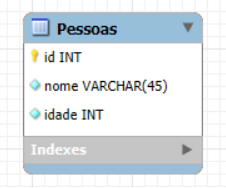

Este projeto tem como objetivo o desenvolvimento de uma **API RESTful** como parte do aprendizado sobre **Back-end**, rotas, protocolos HTTP e a construção de uma aplicação voltada à comunicação entre cliente e servidor.  

Os objetivos de aprendizado foram: entender os conceitos de uma API REST, praticar a criação de rotas (GET, POST, PUT, DELETE), utilizar status do protocolo HTTP, estruturar um Back-end simples, além de aprender o conceito e praticar a realização dos testes unitários.   

As tecnologias utilizadas foram **JavaScript** e **Node.js**.  
A ferramenta de teste utilizada foi o **Postman**.  

A princípio foi criado um objeto "pessoas" com uma lista de pessoas apresentando nome, idade e um id. Este objeto foi utilizado para o aprendizado dos conceitos iniciais e a criação das rotas e testes, de maneira que facilitasse o entenddimento dos novos conceitos.

Após a conclusão da etapa citada anteriormente, foi criado um [script MySQL](./dbapi.sql) para a criação de um banco de dados apresentando uma tabela "Pessoas", com nome, idade e id. As pessoas da lista anterior também foram adicionadas previamente neste novo banco para a utilização nas atualizações que viriam a ser feitas no projeto. 

